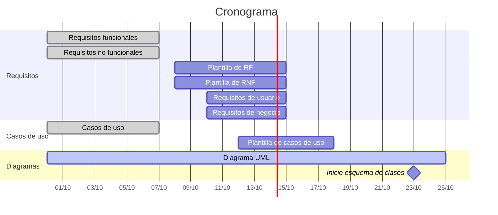

# Planificación

Cronograma de las tareas del proyecto, sincronizado con el tablero de Trello. Las reuniones semanales son los miércoles a las 10:45.

## Roles Scrum

| Rol | Integrantes |
|---|---|
| Scrum Master | Francis |
| Product Owner | Esperanza |
| Developers | Francis, Álvaro, Juan, Marcondes y Esperanza |
| Stakeholders | TurbineH, José Jesús de Benito Picazo (profesor) |

## Tareas

| # | Tarea | Responsables | Inicio | Fin | Estado |
|---|---|---|---|---|---|
| 1 | Requisitos funcionales | Francis, Álvaro y Juan | 30/09/2026 | 07/10/2026 | Revisado |
| 2 | Requisitos no funcionales | Marcondes y Esperanza | 30/09/2026 | 07/10/2026 | Revisado |
| 3 | Casos de uso | Francis, Álvaro, Juan, Marcondes y Esperanza | 30/09/2026 | 07/10/2026 | Revisado |
| 4 | Diagrama UML (reparto en [Diagramas/README.md](../Diagramas/README.md)) | Francis, Álvaro, Juan, Marcondes y Esperanza | 30/09/2026 | 25/10/2026 | En progreso |
| 5 | Redefinición según plantilla de RF | Francis, Álvaro y Juan | 08/10/2026 | 15/10/2026 | Asignado |
| 6 | Redefinición según plantilla de RNF | Marcondes y Esperanza | 08/10/2026 | 15/10/2026 | Asignado |
| 7 | Requisitos de usuario | Francis, Álvaro y Juan | 10/10/2026 | 15/10/2026 | Asignado |
| 8 | Requisitos de negocio | Marcondes y Esperanza | 10/10/2026 | 15/10/2026 | Asignado |
| 9 | Redefinición según plantilla de casos de uso | Francis, Álvaro, Juan, Marcondes y Esperanza | 12/10/2026 | 18/10/2026 | Asignado |
| 10 | Esquema de clases | Por asignar | 23/10/2026 | Por definir | Asignado |
| 11 | Diagrama de clases | Por asignar | Por definir | Por definir | Asignado |

> Los requisitos y casos de uso quedan abiertos a posibles cambios por modificaciones o requisitos adicionales.

## Cronograma

| # | Tarea | Semana 1 30/09 – 07/10 | Semana 2 07/10 – 14/10 | Semana 3 14/10 – 21/10 | Semana 4 21/10 – 28/10 |
|---|---|:---:|:---:|:---:|:---:|
| 1 | Requisitos funcionales | 🟩🟩🟩 | | | |
| 2 | Requisitos no funcionales | 🟩🟩🟩 | | | |
| 3 | Casos de uso | 🟩🟩🟩 | | | |
| 4 | Diagrama UML | 🟨🟨🟨 | 🟨🟨🟨 | 🟨🟨🟨 | 🟨🟨🟨 |
| 5 | Redefinición según plantilla de RF | | 🟦🟦🟦 | 🟦🟦🟦 | |
| 6 | Redefinición según plantilla de RNF | | 🟦🟦🟦 | 🟦🟦🟦 | |
| 7 | Requisitos de usuario | | 🟦🟦🟦 | 🟦🟦🟦 | |
| 8 | Requisitos de negocio | | 🟦🟦🟦 | 🟦🟦🟦 | |
| 9 | Redefinición según plantilla de casos de uso | | 🟦🟦🟦 | 🟦🟦🟦 | |
| 10 | Esquema de clases | | | | 🟦🟦🟦 |
| 11 | Diagrama de clases | | | | |

🟩 Revisado · 🟨 En progreso · 🟦 Asignado

