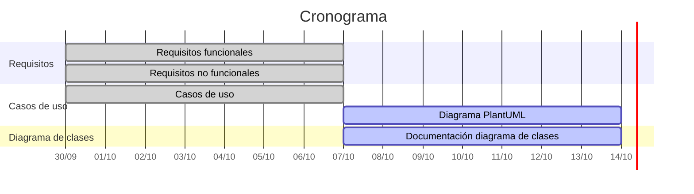

# Planificación

Cronograma de las tareas del proyecto. Las fechas límite coinciden con las reuniones semanales (miércoles, 10:45).

## Roles Scrum

| Rol | Integrantes |
|---|---|
| Scrum Master | Francis |
| Product Owner | Esperanza |
| Developers | Francis, Álvaro, Juan, Marcondes y Esperanza |
| Stakeholders | TurbineH, José Jesús de Benito Picazo (profesor) |

## Tareas

| # | Tarea | Responsables | Inicio | Fin | Estado |
|---|---|---|---|---|---|
| 1 | Revisión de requisitos funcionales | Francis, Álvaro y Juan | 30/09/2026 | 07/10/2026 | Acabado |
| 2 | Revisión de requisitos no funcionales | Marcondes y Esperanza | 30/09/2026 | 07/10/2026 | Acabado |
| 3 | Realización de los casos de uso | Francis, Álvaro, Juan, Marcondes y Esperanza | 30/09/2026 | 07/10/2026 | Acabado |
| 4 | Diagrama de casos de uso (PlantUML) | Francis, Álvaro, Juan, Marcondes y Esperanza (reparto en [Diagramas/README.md](../Diagramas/README.md)) | 07/10/2026 | 14/10/2026 | Pendiente |
| 5 | Documentación del diagrama de clases | Por asignar | 07/10/2026 | Por definir | Pendiente |

> Los requisitos y casos de uso quedan abiertos a posibles cambios por modificaciones o requisitos adicionales.

## Cronograma

| # | Tarea | Semana 1 30/09 – 07/10 | Semana 2 07/10 – 14/10 |
|---|---|:---:|:---:|
| 1 | Revisión de requisitos funcionales | 🟩🟩🟩 | |
| 2 | Revisión de requisitos no funcionales | 🟩🟩🟩 | |
| 3 | Realización de los casos de uso | 🟩🟩🟩 | |
| 4 | Diagrama de casos de uso (PlantUML) | | 🟦🟦🟦 |
| 5 | Documentación del diagrama de clases | | 🟦🟦🟦 |

🟩 Acabado · 🟦 Pendiente

