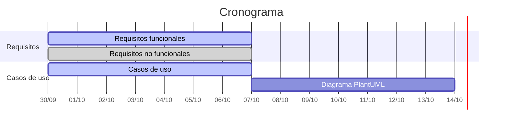

# Planificación

Cronograma de las tareas del proyecto. Las fechas límite coinciden con las reuniones semanales (miércoles, 10:45).

| # | Tarea | Responsables | Inicio | Fin | Estado |
|---|---|---|---|---|---|
| 1 | Revisión de requisitos funcionales | Equipo 1 (Francis, Álvaro, Juan) | 30/09/2026 | 07/10/2026 | Pendiente |
| 2 | Revisión de requisitos no funcionales | Equipo 2 (Marcondes, Esperanza) | 30/09/2026 | 07/10/2026 | Acabado |
| 3 | Realización de los casos de uso | Equipo 1 y Equipo 2 | 30/09/2026 | 07/10/2026 | Pendiente |
| 4 | Diagrama de casos de uso (PlantUML) | Por asignar | 07/10/2026 | 14/10/2026 | Pendiente |

## Cronograma

| # | Tarea | Semana 1 30/09 – 07/10 | Semana 2 07/10 – 14/10 |
|---|---|:---:|:---:|
| 1 | Revisión de requisitos funcionales | 🟦🟦🟦 | |
| 2 | Revisión de requisitos no funcionales | 🟩🟩🟩 | |
| 3 | Realización de los casos de uso | 🟦🟦🟦 | |
| 4 | Diagrama de casos de uso (PlantUML) | | 🟦🟦🟦 |

🟩 Acabado · 🟦 Pendiente

